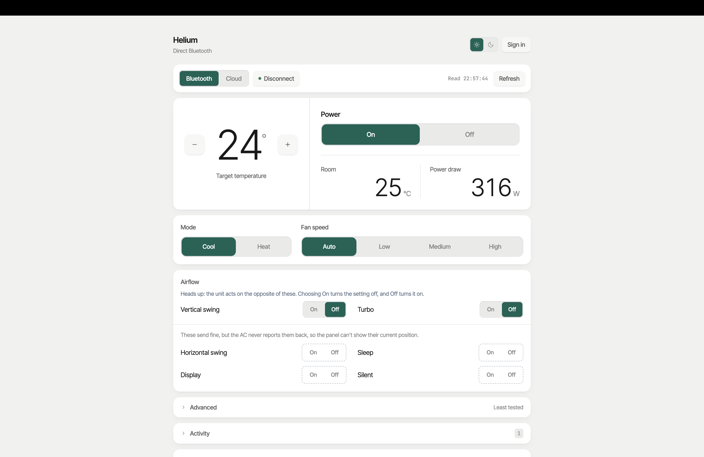
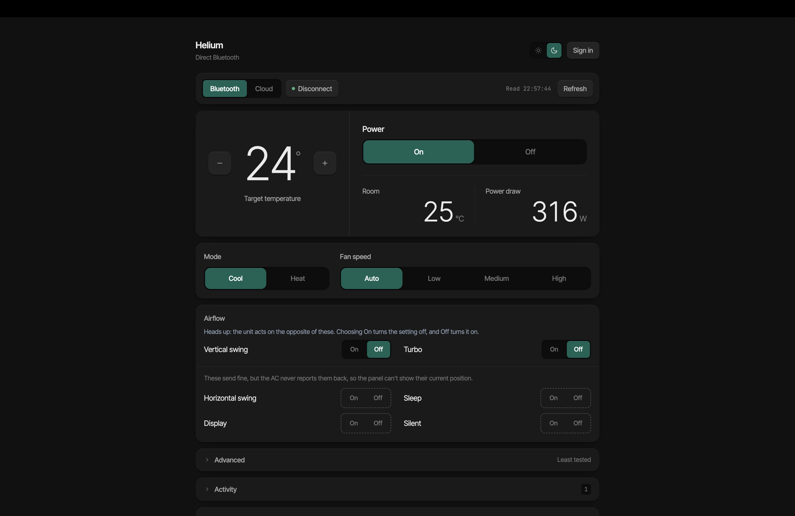
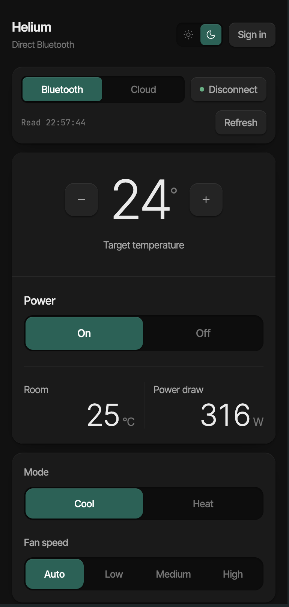
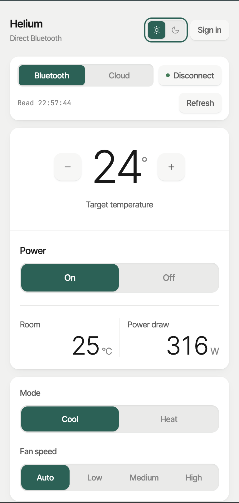

# Helium AC — dual-transport control

Control a Helium air conditioner from your own machine over **BLE** or **AWS IoT
cloud MQTT**, with no vendor app. Both transports are driven from one web panel.

<p align="center">
  
  
</p>

<p align="center">
  
  
</p>

The protocol was recovered by reverse-engineering the vendor Android app — the
full story, wire format and datapoint map live in [`PROTOCOL.md`](PROTOCOL.md).
This file is just how to run it.

> **Unofficial.** Not affiliated with, endorsed by, or supported by Helium Air
> ([heliumair.in](https://heliumair.in/)). "Helium" is their name, not ours. This
> is an independent client for hardware I own, built from clean-room analysis of
> their public app.

### Why this exists

The official Helium app is unpleasant enough to route around. The specific
problem that motivated this: **sessions drop constantly** — you get silently
logged out and have to re-authenticate by SMS OTP before you can change the
temperature, which is a genuinely bad thing to discover at 2am in an Indian
summer. Beyond that it's slow, needs an internet round-trip to Mumbai to talk to
a unit in the same room, and has no automation surface at all.

This panel fixes those directly: no login required for BLE, no cloud dependency,
no session to lose, and a plain HTTP API you can script. The AC is decent
hardware; the software in front of it was the problem.

```
┌─────────────┐   /api    ┌──────────────┐   MQTT/TLS   ┌─────────┐
│ React panel │ ────────► │ Flask server │ ───────────► │ AWS IoT │──┐
└─────────────┘           │              │              └─────────┘  │
                          │              │   BLE (bleak)             ▼
                          └──────────────┘ ────────────────────►  Helium AC
```

Both paths send **byte-identical payloads** — the packet is built once and routed
by transport.

## Requirements

- Python 3 with `paho-mqtt`, `cryptography`, `bleak`, `flask` (already in `.venv/`)
- Node ≥ 18 (frontend deps: `npm --prefix web install`)
- `apk/assets/AWSiOT.p12` + `AmazonRootCA1.pem` for the cloud path (gitignored)
- For BLE: a Mac in range of the unit

## Configure

Everything device-specific lives in `.env` (gitignored). Copy the template and
fill in your unit:

```bash
cp .env.example .env
$EDITOR .env          # set HELIUM_DEVICE_MAC
```

Only `HELIUM_DEVICE_MAC` is required — it addresses your specific AC. Find it in
the hoags device list `macid` field, or from a BLE scan (`python ble/scan.py`).
Everything else (MQTT host, topics, BLE passkey, p12 password) is a vendor
constant already defaulted correctly in `config.py`; override via `.env` only if
yours differs. Real environment variables win over `.env`.

## Run it

**Production** — one server, serves the built UI and the API:

```bash
cd /Volumes/Power/projects/helium-ac
npm --prefix web run build        # only when the frontend changed
.venv/bin/python web/server.py    # → http://localhost:5055
```

**Development** — hot reload, two terminals:

```bash
# terminal 1: API
.venv/bin/python web/server.py

# terminal 2: UI (proxies /api → :5055)
cd web && npm run dev             # → http://localhost:5173
```

> Run from the **repo root** — `web/server.py` imports `helium` / `helium_cloud`
> from there. Use `.venv/bin/python`, not bare `python`, or paho/bleak are missing.

## Using the panel

**Cloud** works from anywhere and needs no setup — pick it in the toggle and go.
State reads take a few seconds (the device's dump is intermittent, so `read_state`
retries across connects) and occasionally come back empty; read again.

**BLE** requires this Mac in range **and the phone app disconnected from the AC** —
the unit accepts a single BLE central and the app wins if it holds the link. Switch
the toggle to BLE, press **Connect**, then use it normally. Reads are instant.

Every action shows which transport it used and the raw hex sent.

### Reading the controls

The panel never guesses. Every control shows one of three states — **on**, **off**,
or **unknown** — and displays a value only if the AC actually reported it. Unknown
is dashed and says so, and is never styled like a settled *off*.

This means the panel knows less over cloud than over BLE, by design:

| | reports |
|---|---|
| both transports | setpoint, room temp, power draw |
| BLE only | power, mode, fan, turbo, vertical swing |
| neither | horizontal swing, sleep, display, silent |

So on cloud, mode/fan/power read *unknown* — that's the device not answering, not a
bug. The bottom row is unknown permanently and stays unknown even after you press
it, because nothing ever confirms those. They're still sendable: unknown controls
give you explicit On/Off buttons rather than a toggle.

Likewise the setpoint reads `—` with the ± buttons disabled until a state read
lands, rather than starting from an invented number.

**Sign-in** (header, top right) is only for the cloud account and device list —
BLE needs no account.

## HTTP API

```bash
# command — one field per request
curl -X POST 'localhost:5055/api/ac/command?transport=cloud' \
     -H 'Content-Type: application/json' -d '{"temperature":24}'

# state
curl 'localhost:5055/api/ac/state?transport=ble'
```

| Endpoint | Notes |
|---|---|
| `GET /api/ac/state` | `?transport=ble\|cloud` (default `cloud`) |
| `POST /api/ac/command` | same selector, via query or a `transport` field |
| `GET /api/ble/status` | `{connected}` |
| `POST /api/ble/connect` / `disconnect` | manage the BLE link |

Command fields: `temperature`, `power`, `fan`, `mode`, `verticalSwing`,
`horizontalSwing`, `turbo`, `sleep`, `display`, `silent`, `convertible`, `timer`.

- `fan`: `auto` \| `low` \| `medium` \| `high`; `mode`: `cool` \| `heat`
- `temperature`: 16–30 °C
- `timer`: an object — `{"timer": {"minutes": 30, "on": true}}`

## Known quirks

These are real and documented in `PROTOCOL.md` §7j–7k — not things to re-debug:

- **`authed: false` from `/api/ble/connect` does not mean commands are refused.**
  The passkey ack only re-fires on a fresh session; writes land regardless
  (verified).
- **Empty cloud state reads happen.** The device's dump is intermittent; the panel
  keeps the last good values rather than blanking. Read again.
- **`timer` and `convertible` are least tested** — they move no observable
  datapoint, so they're tucked into an "Advanced" section. The unit beeps on
  receipt, which is the only confirmation available.
- **`sleep` / `display` / `silent` / `horizontalSwing` don't echo a distinct
  datapoint** either — they're accepted (audible beep) but won't change the readout.
  The panel shows them as permanently *unknown* rather than pretending they're off.
- **The airflow toggles act inverted.** Sending *on* leaves the unit *off*, and
  vice versa. Confirmed for vertical swing and turbo by e2e capture, and for
  sleep, display and silent by watching the unit directly. Only horizontal swing
  is unchecked. The payload builders stay byte-identical to the vendor app, so
  this is the device's behaviour rather than ours — see PROTOCOL §7l for why it
  isn't "corrected" in code.

## Layout

| Path | What |
|---|---|
| `config.py` | Deployment config from `.env` — device MAC, endpoints, vendor constants |
| `helium_cloud.py` | Cloud MQTT: connect, `read_state`, `publish_command`, all 12 payload builders |
| `helium.py` | BLE client (async/bleak): `connect`, `login`, `send` |
| `web/server.py` | Flask — API for both transports, serves the built SPA |
| `web/ble_bridge.py` | BLE on a background asyncio loop, exposed to sync Flask handlers |
| `web/src/` | The control panel — `App.jsx`, `useAcState.js`, `components/` (React + Vite + Tailwind) |
| `ble/`, `frida/` | Reverse-engineering scripts — scanning, captures, app hooks |
| `PROTOCOL.md` | Full protocol, datapoint map, and how it was derived |

## Safety & scope

This talks to a real appliance over its vendor cloud and to hardware in your home.
Credentials (`*.p12`, `*.pem`, `apk/assets/`) are gitignored — keep them that way,
and configure your own unit via `.env` (see [Configure](#configure)).

Intended for **hardware you own**. It authenticates as your own account against
your own device; it isn't a way to reach anyone else's AC, and the BLE path needs
physical radio range. The vendor's own credentials extracted from their APK are
deliberately **not** redistributed here — you supply them from your own install.

Interoperating with a device you bought is broadly legal in most jurisdictions,
but this is published as-is with no warranty, and the vendor may change their
protocol at any time.
